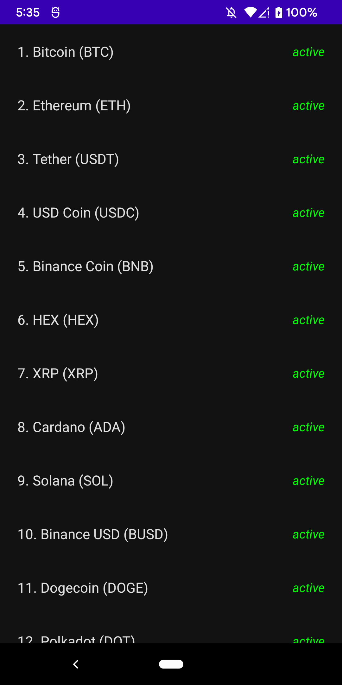
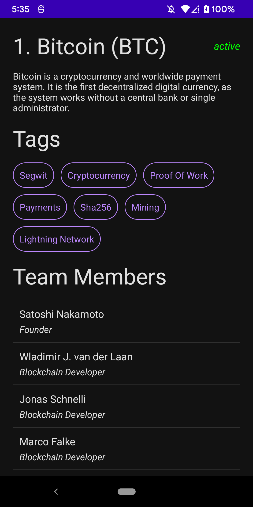
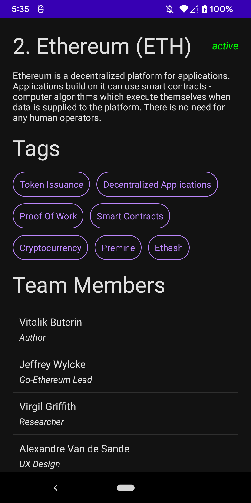

# Krypton

### **Overview - About this project**
This is a simple Cryptocurrency App using Clean Architecture (MVVM, Use Cases, Compose)  and also Jetpack Compose to show a modern **UI/UX**

### **Explanation about the name Krypton**
I know Cryptocurrency writes with *Crypto* but as a great fan of Superman I just decided to use it's planet as my project name inspiration

For this API is used:
- Coin Paprika API
coinpaprika.com

Get coins route:
- https://api.coinpaprika.com/v1/coins

Get a coin by ID route:
- https://api.coinpaprika.com/v1/coins/btc-bitcoin

### 📷 How is this App
</img>
</img>
</img>

### 💻Technology
- [Kotlin](https://kotlinlang.org/)
- [Jetpack Compose](https://developer.android.com/jetpack/compose)
- [Dagger Hilt](https://dagger.dev/hilt/)

### References
- https://www.youtube.com/watch?v=EF33KmyprEQ
 
### Donation
If this project help you reduce time to develop, you can buy me a cup of coffee :) 

